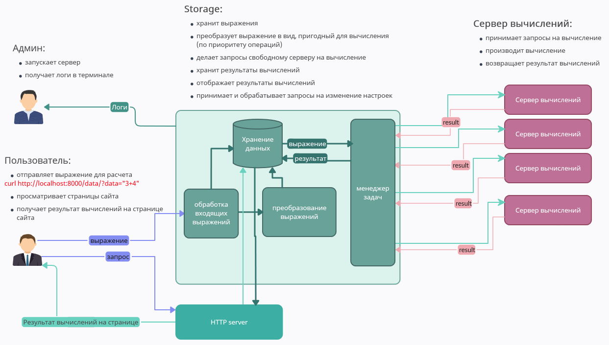

    для просмотра этого файла в VSCode: Ctrl + Shift + v
    tg @Dmi_G

# Распределенный калькулятор

## Описание
Программа реализует распределенный вычислитель арифметических выражений.

### Краткое описание работы
Для вычисления реализована "польская нотация", результат по мере вычисления показывается на странице в браузере. 

Пользователь передаёт в программу арифметическое выражекние для расчёта.

После этого каждое выражение разбивается на арифметические пары (действия), каждая такая пара вычисляется отдельно согласно приоритетам арифметических операторов.

В настройках задаётся время вычисления каждого арифметического действия (имитация сложных расчетов).

Каждое входное выражение обрабатывается в отдельной горутине.

Для работы с программой будет необходимо два окна терминала: в первом окне будет запуск программы и логирование, во втором - ввод данных и изменение настроек, и браузер.

### Что для этого реализовано:
- Обработаны ошибки:

    - на только инты (как числа) 
    - на арифметические знаки
    - возведение в степень в виде `**` и `^`
    - на непарные скобки
    - на данные конфига пользователя (неверные данные будут проигнорированы или будет возвращено описание ошибки (например, в случае, когда порт из новорго конфига занят))
    - количество серверов обработки данных (установится не меньше 1 сервера)
    - отрицательное время обработки каждой операции заменяется 0

- Реализовано логирование всех действий в консоль
- Реализован вывод результатов и промежуточных состояний на странице в веб-браузере.
- Реализована проверка присланного выражения на уникальность: если введённое выражение уже присутствует в БД, повторно такое выражение не добавится. По умолчанию - отключена (задаётся в настройках).
- Реализован начальный ввод настроек программы
- Реализовано изменение настроек в ходе выполнения программы по запросу
- Реализовано сохранение настроек последнего запуска по выбору этого режима при запуске прлограммы: после перезагрузки программы настройки не теряются.
- Реализовано сохранение введённых и решённых выражений: после перезапуска программы загруженные выражения не теряются, результыты вычислений не теряются, нерешённые выражения в приоритетном порядке отправляются на выполнение.
- Реализована очистка баз данных по запросу. При этом при переходе на страницу браузера через меню сайта очистка БД недоступна (защита от случайной очистки БД). При переходе по прямой ссылке в браузере (недоступно через меню) и по запросу curl очистка производится без предупреждения (предполагается, что продвинутый пользователь понимает, что делает).
- Реализовано обработка ошибок в файле конфига (подробнее - ниже)
- Реализован запуск вычислений в разных горутинах.
- Реализован мониторинг воркеров: результат работы воркеров логируется в терминал, помимо этого на странице сайта отображаются этапы вычисления выражения. На странице Список вычислительных мощностей указано количество занятых в данный момент серверов
- Реализован графический интерфейс для просмотра настроек системы и этапов выполнения вычислений (hhtp сайт)
- Реализована возможность замены дизайна сайта "на лету". Все страницы разбиты на блоки, одинаковые блоки не дублируются, вынесены в отдельные общие файлы. Для замены дизайна достаточно поправить необходимый файл в папке front, дизайн всех страниц изменится. При следующем обращении пользователь увидит страницу в новом дизайне.

#### Особенности реализации:

- работа с отрицательными числами (даже появляющимися в процессе вычислений). В таком случае результат всего выражения будет `nil` - проблема на стадии потенциальное TODO.
- в терминал, в котором отправляются запросы, отправляется код страницы - сделано специально, это технический терминал
- обрабатываются арифметические операторы: `+`, `-`, `*`, `/`, `**` или `^`. Остальные не обрабатываются и не планируется.
- допускается последовательное применение нескольких операторов `минус`: это не считается ошибкой (пример: 3*--1 = 3). Ориентировался на https://www.desmos.com/fourfunction?lang=ru
- на всех этапах вычислений происходит округление до интов

### Настройки программы
Основной конфиг (если требуется) необходимо создать в папке configs. Например, в файле c1.conf. Имя config_prev.conf зарезервировано системой для хранения предыдущего конфига.

Имя этого файла конфига программа запросит при запуске. Возможные варианты:

- ввести 0 или ничего не вводить - будет загружен конфиг по умолчанию и перезаписан предыдущий конфиг
- ввести 1 - будет загружен предыдущий конфиг
- ввести путь к файлу конфига в формате `configs/c1.conf` - будет загружен новый конфиг и перезаписан предыдущий конфиг

Подробное описание файлов конфига - в разделе Архитектура приложения (ниже)

Во время работы можно изменить настройки:

- отправить запрос на изменение количества серверов 
- отправить запросы на изменение времени обработки каждой арифметической операции (подробности - ниже)

### Обоснование принятого решения
При принятии решения об архитектуре основывался на:

- написание фронта (и фронтовые языки типа js) не входят в программу курса, постарался их избежать

    

- сторонние библиотеки не использовал для облегчения работы проверяющего студента
- docker и аналоги не использовал по той же причине

В результате для запуска Калькулятора потребуются только стандартеые библиотеки Golang, два окна терминала и браузер.

Подробнее об архитектуре приложения см ниже в разделе Архитектура приложения

## Запуск программы:

1. В терминале выполнить
```bash
    go run $(ls *.go)
```
2. Если специальный конфиг не требуется - нажать Enter. (Про конфиг написано в разделах Настройки программы (выше) и Архитектура приложения (ниже))

3. В Windows разрешить общедоступным и частным сетям доступ к приложению

    

4. В этом терминале будет логирование работы программы. В частности, в первом логе будет указан порт, на котором работает GUI калькулятора.

## Работа с калькулятором
В браузере:
```bash
http://localhost:8000 // порт заменить на правильный
Страницы сайта:
- "/" - начальная страница  
- "/data" - страница для получения арифметического выражения
- "/list/" - страница со списком выражений
- "/settings/" - страница со списком операций в виде пар: имя операции + время его выполнения
- "/resources/" - страница со списком вычислительных мощностей
- "/clearDbAttention" - страница очистки БД
```
Для просмотра GIU после запуска программы перейти в браузере по адресу http://localhost:8000 (порт 8000 по умолчанию, замените на правильный (указан в терминале при запуске программы))

Страница - статическая, для просмотра актуальной информации страницу необходимо обновлять. 

Для использования калькулятора ***в отдельном терминале*** отправьте на сервер запрос типа:

- отправка алгебраического выражения на вычисление:
```bash
curl http://localhost:8000/data/?data="2+6*7-(2*8)**4+1"
Допустимые знаки: `+`, `-`, `*`, `/`, `**` или `^`, `(`, `)`, пробелы и табы недопустимы.
```
В терминале, в котором производился запуск калькулятора, произойдёт логирование всех действий:


В случае, когда в конфиге задано условие на проверку уникальности заданий, неуникальные задания добавлены не будут, это отразится в логе:


Просмотр работы калькулятора возможен в браузере на вышеуказанных страницах:


Другие возможности:

- изменение времени обработки каждого алгебраического выражения:
```bash
curl http://localhost:8000/settings/?settings="oetMinus=55"
curl http://localhost:8000/settings/?settings="oetPlus=55"
curl http://localhost:8000/settings/?settings="oetMultiply=55"
curl http://localhost:8000/settings/?settings="oetDivide=55"
curl http://localhost:8000/settings/?settings="oetPower=55"
```

- Изменение количества серверов:
```bash
curl http://localhost:8000/resources/?resources="qtyServers=4"
```


- Очистка баз данных
```bash
curl http://localhost:8000/clearDb/   # очистка баз данных
```

## Архитектура приложения
### Как это все работает



### База данных
Файлы баз данных размещаются в папке `db`

- файл `expressions.db`

Этот файл используется для хранения присланных выражений, имеет следующий формат:

```
порядковый_номер : выражение : подготовленное_выражение : статус : ответ
где:    [0]-порядковый_номер - номер по порядку, присваивается в процессе получения выражения, необходим для идентификации запросов
        [1]-выражение - это присланное выражение
        [2]-подготовленное_выражение - это же выражение, подготовленное по правилам Польской нотации
        [3]-статус - принимает одно из трёх состояний: ожидает(0), в работе(1), выполнено(2). В работу попадает в случае наличия свобоных серверов
        [4]-ответ - результат вычислений
```
Обращение к этому файлу защищается мютексом muExpressions (глобальная переменная)

### Хранение конфигов
Файлы конфигов размещаются в папке `configs`

- файл `config_prev.conf` зарезервирован системой и используются для хранения предыдущего конфига соответственно.

Имя файла конфига запрашивается при старте приложения

Текущий конфиг приложения сожраняется в процессе работы для возможности запуска после перезагрузки системы.

Пользователь может создать в этой папке (`configs`) свой конфиг, который должен соответствовать правилам:

        - Поля файла конфига должны быть записаны в формате `имя параметра` пробел `значение`, каждый параметр с новой строки.
```
        	port            string // порт, на котором запускается, по умолчанию 8000
            checkUnicTask   int    // проверка введённого выражения на уникальность (0 не проверять, 1 проверять), по умолчанию 0
            oetPlus         int    // operation execution time: + , seconds
            oetMinus        int    // operation execution time: - , seconds
            oetMultiply     int    // operation execution time: * , seconds
            oetDivide       int    // operation execution time: / , seconds
            oetPower        int    // operation execution time: ^ , seconds
            qtyServers      int    // количество возможных параллельных вычислений (серверов)
```
        - В случае ошибки в новом конфиге (отсутствие данных, формат данных и проч) для таких переменных будут установлены значения по умолчанию. 
        - В случае ошибки в формате данных файла конфига (таб/табы или комбинация табов и пробелов в качестве разделителя), - это будет поправлено при парсинге

- глобальная переменная `config_main`

Хранит информацию о текущем конфиге, инициализируется при старте программы на основании значений по умолчанию, конфига по умолчанию и нового конфига в зависимости от параметров запуска (запрашиваются при запуске приложения). Например, можно задать свой конфиг (указать имя файла конфига), определить, необходимо ли тратить ресурсное время на расчет неуникальных выражений (скрины размещены в разделе "Работа с калькулятором"). Может быть изменена в процессе работы по запросам пользователя.

Обращение к конфигам защищается мютексом muConfigs (глобальная переменная)

### Начальная инициализация системы

Начальная инициализация системы происходит при запуске программы. При запуске программы пользователь указывает на необходимый файл конфигурации, либо разрешает применить конфигурацию по умолчанию, либо использовать настройки предыдущего запуска.

В процессе работы пользователь имеет возможность изменить настройки:

- изменить время выполнения каждой арифметической операции
- изменить количество одновременно работающих серверов вычислений.

Программа подхватывает данные "на лету".


## Тестирование программы
#### Ответы можно проверить [здесь]( https://www.desmos.com/fourfunction?lang=ru)
Предлагаю следующую программу тестирования:
Запустить программу с конфигом по умолчанию
```bash
go run $(ls *.go)
# Enter
```
В браузере перейти по адресу и убедиться, что сайт поднят: http://localhost:8000

Посетить остальные страницы сайта и посмотреть начальные значения программы

В VSCode перейти в папку db и открать файл БД `expressions.db` (что бы в реальном времени следить за изменением БД)

В соседней вкладке VSCode открыть файл `config_prev.conf` (что бы в реальном времени следить за изменением конфига)

В начальном конфиге заданы время выполнения каждой операции по 6 секунд

После этого в отдельном терминале запустить несколько несложных выражений (можно прямо выделить следующие выражения с нижней пустой строкой - скопировать - перейти в терминал - Ctrl+Shift+v)
```
http://localhost:8000
```
```bash
curl http://localhost:8000/data/?data="2+10/5-3"
curl http://localhost:8000/data/?data="2+(10/5-3)"
curl http://localhost:8000/data/?data="2+(10/5-3)*2"
```
Посмотреть на изменение файла БД

Посмотреть на сайте на изменение списка выражений. Понаблюдать, как в списке выражений меняется статус (предпоследний столбец)

Посмотреть на логи в терминале, в котором запускали программу

После этого принудительно завершить программу (Ctrl+c)

Исправить в файле БД у некоторых выражений статус (цифру 2 заменить на 0 или 1) и ответ (в последний столбец поставить 0).

Заново запустить программу. Но в этот раз при запуске указать 1 (использовать конфиг последней загрузки).
```bash
go run $(ls *.go)
1 # Enter
```

В логах убедиться, что эти выражения взяты в работу.

Понаблюдать, как в процессе работы меняются данные в БД.

После этого изменить время выполнения операций:
```bash
curl http://localhost:8000/settings/?settings="oetMinus=2"
curl http://localhost:8000/settings/?settings="oetPlus=2"
curl http://localhost:8000/settings/?settings="oetMultiply=2"
curl http://localhost:8000/settings/?settings="oetDivide=2"
curl http://localhost:8000/settings/?settings="oetPower=2"
```
Посмортреть на странице сайта, что данные изменились.

Изменить количество вычислительных серверов:

```bash
curl http://localhost:8000/resources/?resources="qtyServers=3"
```
Проверить, что изменения внесены в файл конфига.

Запустить тестовые выражения и наблюдать, как меняются данные в БД

```bash
curl http://localhost:8000/data/?data="3+4*22/(1+5)+2^2^3"
curl http://localhost:8000/data/?data="5+7-8*2+66*(2-1)+1"
curl http://localhost:8000/data/?data="5+7-8*2+66*(2-1)+1+1"
curl http://localhost:8000/data/?data="3-+--1"
curl http://localhost:8000/data/?data="18+6*8-15/3"
curl http://localhost:8000/data/?data="94+15-58/2+16/4/2"
curl http://localhost:8000/data/?data="155/5+5**2"
curl http://localhost:8000/data/?data="1-156/2+15+84*3-16/2"
curl http://localhost:8000/data/?data="85*2-14/2+33*2-12/3"
curl http://localhost:8000/data/?data="85*(2-14/2)+33*2-12/3"
curl http://localhost:8000/data/?data="14-2*8+5*9-48/6"
curl http://localhost:8000/data/?data="14-2*(8+5*9)-48/6"

```
Правильные ответы
```
81
63
64
2
61
82
56
182
225
-363
35
-100
```
```bash

```
Отправить запрос на очистку БД
```bash
curl http://localhost:8000/clearDb/
```
Посмотреть на файл БД и странички в браузере.

Ошибочные запросы (данные не вносятся в БД, в логах - ошибки):
```bash
curl http://localhost:8000/data/?data="3*/"
curl http://localhost:8000/data/?data="3-+--*1"


```


Литература:

- https://alextonkonogov.ru/?p=351


